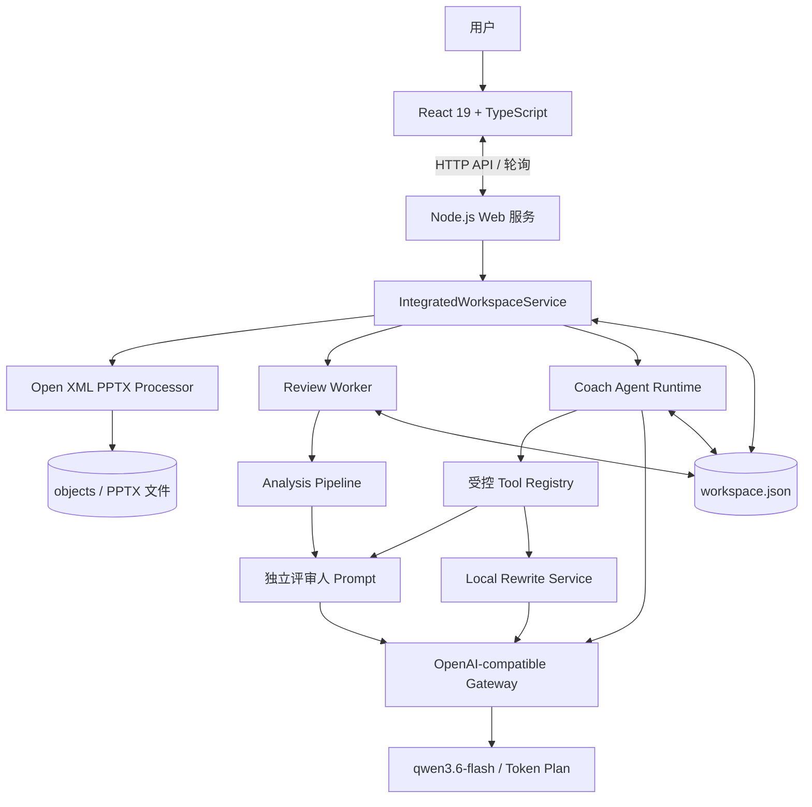
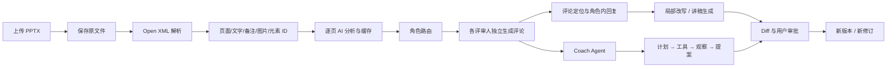
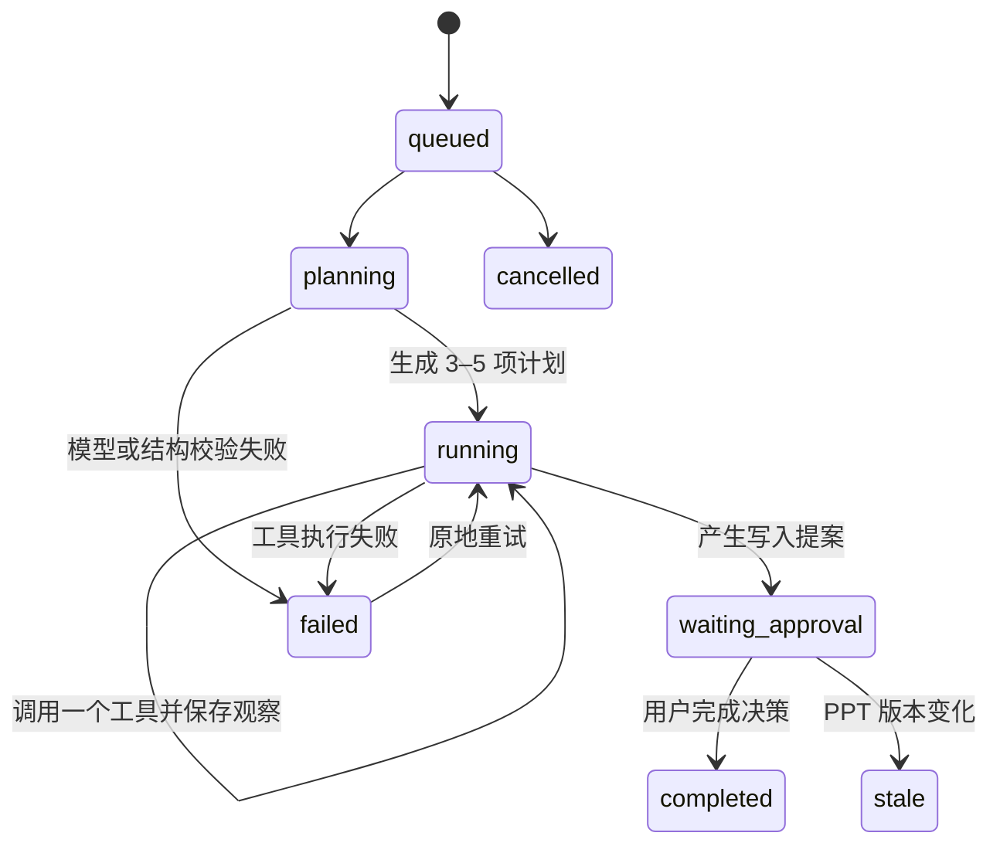

# PPT Presentation Assistant · 汇报预演室

面向真实汇报场景的本地 AI PPT 评审与演练工作台。它不替用户重新生成一套 PPT，而是围绕已有的 `.pptx`，完成文件解析、多角色评审、评论追问、局部改写、逐页讲稿和教练 Agent 闭环，并将所有写入操作置于用户审批之下。

> 当前定位：可本地运行、可恢复、可审计的单用户 MVP。适合产品演示、技术研究和本地材料预演，不应直接作为多租户在线服务部署。

## 项目简介

用户通常很熟悉自己的材料，却很难站在听众角度发现证据不足、叙事断层、信息密度过高、页面难懂或讲稿衔接生硬等问题。通用聊天模型可以给建议，但容易脱离具体页面、缺少稳定角色视角，也难以把“发现问题—定位页面—修改—复查—演讲准备”串成一个可追踪流程。

本项目将一次 PPT 预演拆成三层：

1. **确定性材料层**：解析 PPTX 的页面、文字、备注、图片关系、元素坐标和版本信息。
2. **多角色评审层**：不同 AI 评审人基于同一份 PPT 事实，各自保持独立人设和对话上下文。
3. **教练 Agent 层**：跨页面、跨评审意见制定计划，自主调用受控工具取证，再生成等待用户批准的改进提案。

## 核心能力

- 上传并解析最多 **60 页、50 MB** 的 PPTX，保留原始文件。
- 上传首页即入口，提供解析进度、简笔画加载动画和等待小游戏。
- 左侧缩略图、中间 PPT 画布、右侧工作流面板组成三栏评审工作台。
- 提取原生文字、备注、页面顺序、稳定元素 ID、图片和部分 Open XML 图形。
- 自动生成可编辑的“汇报目标”和“期望听众回应”；二者不是必填项。
- 默认选择 3–4 位互补的 AI 评审人，生成定位到页面的短评论。
- 同一评审人的评论可折叠展开；评论支持定位页面和线程式回复。
- 每位评审人拥有独立人设与历史，不会与其他评审人的私人对话串线。
- 选中 PPT 或讲稿局部文字后生成 Diff，由用户接受或拒绝。
- 基于整套材料生成逐页完整讲稿，考虑上下页关系、过渡语和总时长。
- 版本化保存 PPT 修改，不覆盖原始文件；支持导出派生 PPTX。
- 提供持久化教练 Agent：计划、取证、工具调用、改进提案和逐项审批。
- 分析任务、页缓存、评论线程、Agent Run 和审批状态可跨刷新与服务重启恢复。

## 技术路线



整体采用 **TypeScript pnpm Monorepo + 本地纵向切片**：React 前端、HTTP 服务、Worker、PPTX 引擎、AI 网关、领域契约和文件持久化均在一个仓库中。默认由 Web 进程内嵌 Worker，方便一条命令启动；也支持将 Worker 独立运行。

### 主工作流与数据流



分析重试会复用已经完成的 PPT 解析和成功页缓存。缓存键包含项目、模型与接口命名空间、Prompt/Schema 版本、稳定页面 ID、内容和布局信息；修改相关页面时才会让对应缓存失效。

## 教练 Agent 架构

教练不是自由聊天框，也不是把一段 Prompt 命名为 Agent。它是一个持久化、受预算约束的状态机：模型每轮只能返回一个结构化动作，程序负责执行工具、校验版本、保存观察并推进状态。



当前工具：

| 工具 | 类型 | 作用 |
| --- | --- | --- |
| `inspect_deck` | 只读 | 读取整套目录、目标、讲稿字数和预计时长 |
| `inspect_slide` | 只读 | 读取指定页文字、备注、讲稿、分析和相关评论 |
| `summarize_reviews` | 只读 | 按根因聚合不同评审人的问题与证据 |
| `ask_reviewer` | 只读/模型 | 向指定评审人追问，保持角色上下文隔离 |
| `check_narrative` | 只读 | 检查结构、时长、过渡和证据 |
| `propose_ppt_rewrite` | 提案 | 生成 PPT 局部改写建议，不直接写入 |
| `propose_script_rewrite` | 提案 | 生成讲稿局部改写建议，不直接写入 |

Agent 设有步骤数、模型调用数、工具调用数、评审追问数和提案数预算。工具调用以 `callId` 幂等，Run 绑定 `baseVersionId`，讲稿提案额外绑定 `scriptRevision`。版本变化后旧 Run 会进入 `stale`，防止把旧建议写入新材料。

## 评审人上下文与记忆

每位评审人的逻辑会话键是 `projectId + reviewerId`：

- **共享事实**：当前 PPT、页面分析、汇报背景和目标。
- **角色私有上下文**：该评审人的 Markdown 人设、评论及与用户的回复历史。
- **不会共享的内容**：其他评审人的私人回复线程。
- **长期数据**：评论、回复、任务、缓存和 Coach Run 持久化在 `workspace.json`。
- **短期上下文**：每次模型调用时由服务端重新组合，只在本次请求内存在。

当前没有向量数据库、Embedding、供应商端常驻 Assistant 或隐藏思维链存储。系统只保存计划、工具输入、观察摘要、证据、提案和用户可读理由。

评审人 Prompt 位于 `packages/ai/src/prompts/reviewers/`，教练 Prompt 位于 `packages/ai/src/prompts/coach.md`。PPT 正文、备注和评论均作为不可信数据传入，不能向运行时下达指令。

## 技术栈

| 层级 | 技术 |
| --- | --- |
| 语言与运行时 | TypeScript 5.9、Node.js 24+、ES Modules |
| Monorepo | pnpm 11 Workspace |
| Web | React 19、React DOM、esbuild、Phosphor Icons |
| HTTP / Worker | Node.js、tsx、内嵌或独立 Worker |
| 数据校验 | Zod 4 |
| PPTX | JSZip、@xmldom/xmldom、Open XML；测试生成使用 PptxGenJS |
| AI | OpenAI-compatible `/chat/completions`、JSON Schema、qwen3.6-flash |
| 存储 | 本地 JSON 原子快照、对象文件、跨进程目录锁 |
| 数据库预留 | Drizzle ORM / PostgreSQL Schema（当前运行时未启用） |
| 测试 | Vitest、Playwright、axe-core、pixelmatch |
| CI | GitHub Actions、Windows + Microsoft Edge |

## 仓库结构

```text
apps/
  web/                 React UI、HTTP API、业务装配、浏览器 E2E
  worker/              评审 Worker、Coach Runtime、受控工具
packages/
  ai/                  模型网关、分析流水线、Prompt、改写与讲稿生成
  contracts/           跨层共享类型、Schema 和状态契约
  db/                  本地存储、迁移、锁及预留数据库模型
  domain/              项目、版本和工作区领域服务
  pptx/                PPTX 解析、图片读取、文本修改和导出
development/           分阶段开发规格与交接文档
docs/                  当前架构、数据流和设计说明
tests/                 PPTX fixture、视觉基线和验收资源
.local-data/           本地运行数据，已忽略，不应提交
```

## 快速开始

### 环境要求

- Node.js `>= 24`
- pnpm `11.22.0`
- Windows 推荐 Microsoft Edge；视觉回归基线基于 Windows + Edge
- 一个千问 Token Plan API Key

### 安装与配置

```powershell
git clone https://github.com/xswdd666/PPT-Presentation-Assistant.git
Set-Location PPT-Presentation-Assistant
pnpm install --frozen-lockfile

# 仅首次创建；不要覆盖已有 .env
if (!(Test-Path .env)) { Copy-Item .env.example .env }
```

编辑 `.env`：

```dotenv
NODE_ENV=development
WEB_HOST=127.0.0.1
WEB_PORT=3000

MODEL_PROVIDER=openai_compatible
MODEL_API_KEY=在这里填写你的_Token_Plan_Key
MODEL_BASE_URL=https://token-plan.cn-beijing.maas.aliyuncs.com/compatible-mode/v1
MODEL_NAME=qwen3.6-flash

EMBEDDED_WORKER=true
```

请勿提交 `.env`。模型密钥只由服务端读取，不会发送到浏览器或写入工作区快照。

### 初始化与启动

```powershell
pnpm db:migrate
pnpm dev
```

打开 [http://127.0.0.1:3000/](http://127.0.0.1:3000/)。默认入口是 PPT 上传页；上传后进入项目设置与评审工作台。

若需要独立 Worker，在 `.env` 设置：

```dotenv
EMBEDDED_WORKER=false
DATA_DIR=D:\absolute\path\to\deck-data
```

然后分别运行：

```powershell
# 终端 1
pnpm dev:web

# 终端 2
pnpm dev:worker
```

两个进程必须使用相同的绝对 `DATA_DIR`。

## 使用方法

1. 在首页选择 `.pptx` 文件并填写项目名称、场景、听众和预计时长。
2. 等待本地解析；进度页会显示当前状态，分析期间可以操作小游戏。
3. 汇报目标和期望听众回应可以留空，系统会生成可编辑建议。
4. AI 分析完成后进入“评审”，浏览按评审人组织的页面级评论。
5. 点击“定位页面”跳转到证据页；在评论下回复时只与该评审人继续对话。
6. 在 PPT 或讲稿中选中文字，发起 AI 改写并检查 Diff；接受才会写入。
7. 打开“讲稿”查看整套逐页演讲稿，继续手工编辑或局部改写。
8. 打开“教练”，设置本轮目标，观察 Agent 的计划、工具时间线和证据。
9. 对教练提案逐项接受或拒绝；拒绝不会改变 PPT、讲稿或版本。
10. 在“版本”中检查修改记录并导出新的 PPTX。

## 本地数据、备份与恢复

默认数据目录为仓库下的 `.local-data`：

```text
.local-data/
  workspace.json       项目、版本、页面、评论、回复、任务、缓存、讲稿、Agent Run
  objects/             原始及派生 PPTX
  workspace.lock/      写入期间的跨进程锁目录
```

写入由进程内队列和跨进程锁串行化，先写临时快照，再原子替换 `workspace.json`。这适合本机 MVP，但不是数据库事务引擎。

备份前先停止 Web 与 Worker，再复制整个数据目录：

```powershell
Copy-Item -LiteralPath .local-data -Destination ('../deck-backup-' + (Get-Date -Format 'yyyyMMdd-HHmmss')) -Recurse
```

恢复时将备份还原到空目录，并让 `DATA_DIR` 指向它。只有在确认所有写进程均已停止并完成备份后，才可处理异常退出留下的空 `workspace.lock` 目录。

## 验证与测试

```powershell
# 全量：类型、Lint、格式、单元/集成和浏览器 E2E
pnpm check

# 常用定向验证
pnpm typecheck
pnpm test:unit
pnpm test:integration
pnpm test:acceptance
pnpm exec vitest run apps/worker/src/coach-runtime.test.ts
pnpm exec vitest run --config vitest.e2e.config.ts apps/web/src/server/coach.e2e.test.ts
```

无需真实模型凭证的验收使用确定性模型替身，但仍覆盖真实 HTTP、浏览器、PPTX、Worker 和本地存储。真实模型的质量、延迟和费用需要单独使用脱敏材料验收。

## 产品与技术边界

当前明确不做：

- 从零生成整套 PPT，或成为完整在线 PowerPoint 编辑器。
- 自由移动、缩放、新建或重排页面元素。
- 自动修改图片、图表数据、SmartArt、动画、转场、视频或母版。
- PDF 上传、语音视频分析、姿态表情分析和独立文字问答预演。
- 联网搜索、外部事实核验、任意代码执行或通用 Agent 平台。
- 用户自定义评审人 Prompt、真人评审、多人实时协作、组织权限和计费。
- 移动端完整编辑；窄屏仅保证评论浏览和基础导航。

已知技术限制：

- PPTX 预览是 Open XML 结构化重建，不等同于 PowerPoint 原生渲染。复杂母版、SmartArt、图表、特殊字体、部分形状和组合元素可能存在差异。
- 当前模型主要接收结构化文字、备注、布局与已有视觉摘要；页面中显示原图不代表模型完成了多模态原图理解。
- 本地 JSON 会随项目和历史增长而出现整文件读写、上下文膨胀和并发扩展瓶颈。
- 当前没有账号、鉴权、租户隔离、加密存储和生产级密钥管理，服务默认只绑定回环地址。
- PostgreSQL、对象存储和外部任务队列是预留方向，当前相关配置不参与本地运行。
- 评审人长期历史目前按角色聚合后重新注入，没有摘要压缩、相关历史检索或 Token 预算裁剪。
- AI 结果只能作为辅助判断；系统校验结构和版本一致性，但不能保证模型结论与外部事实完全正确。

## 设计原则

- **原文件不覆盖**：所有正式 PPT 修改形成派生版本。
- **人始终掌控写入**：AI 和 Agent 只能给建议，不能批准自己的提案。
- **角色上下文隔离**：共享 PPT 事实，不共享私人对话。
- **先取证再建议**：评论和 Agent 结论尽量绑定稳定 Slide ID。
- **可恢复与幂等**：任务、工具调用和审批均有恢复、防重复和版本校验。
- **不保存隐藏思维链**：只持久化用户可理解、可审计的计划与观察。
- **本地优先**：文件、工作区和队列默认保存在用户机器上。

## 延伸文档

- [产品规格](Deck-Rehearsal-SPEC-v0.1.md)
- [当前架构与数据流](docs/current-architecture.md)
- [集成验收交接](development/06-integration-handoff.md)
- [教练 Agent 开发规格](development/07-coach-agent-spec.md)

## 安全提示

请只使用有权处理的演示文稿。开始 AI 分析后，PPT 中提取的文字、备注、布局摘要和必要上下文会发送给 `.env` 中配置的模型服务。不要在截图、日志、Issue 或提交记录中暴露真实 API Key、敏感 PPT 正文或 `.local-data` 内容。
