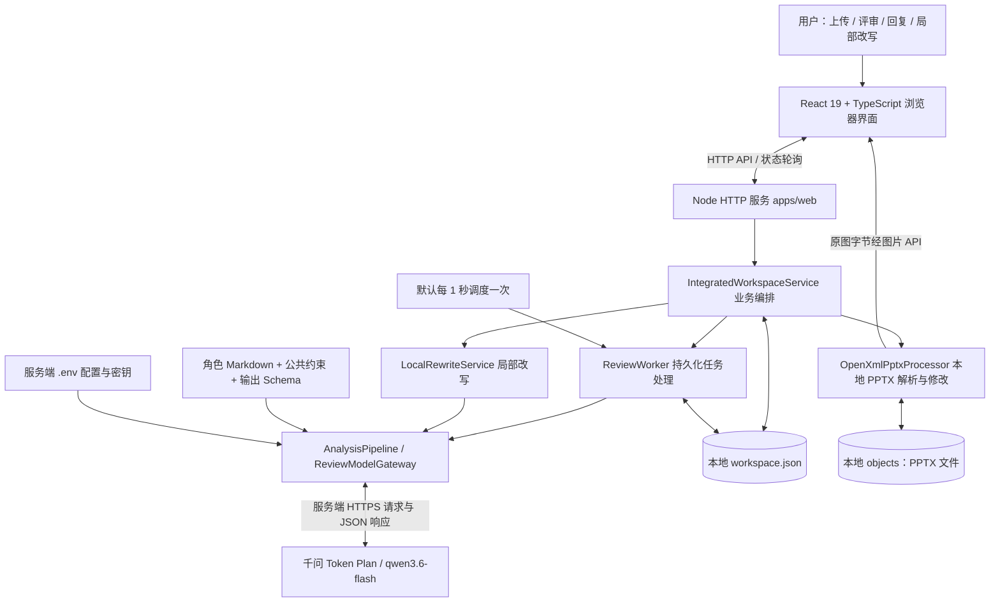
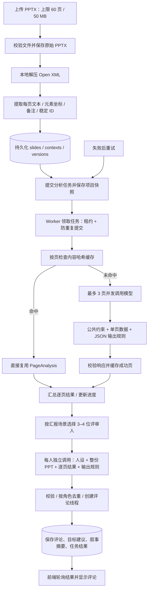
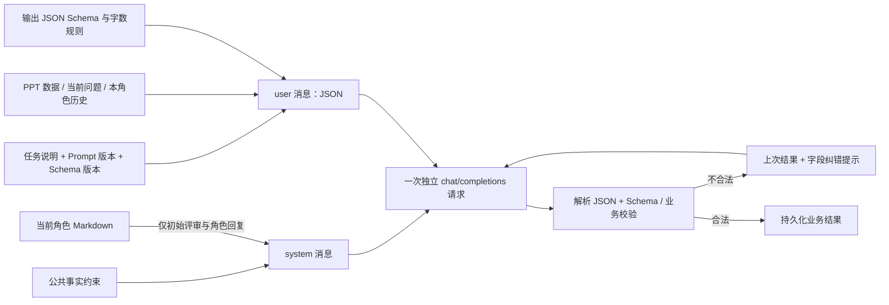
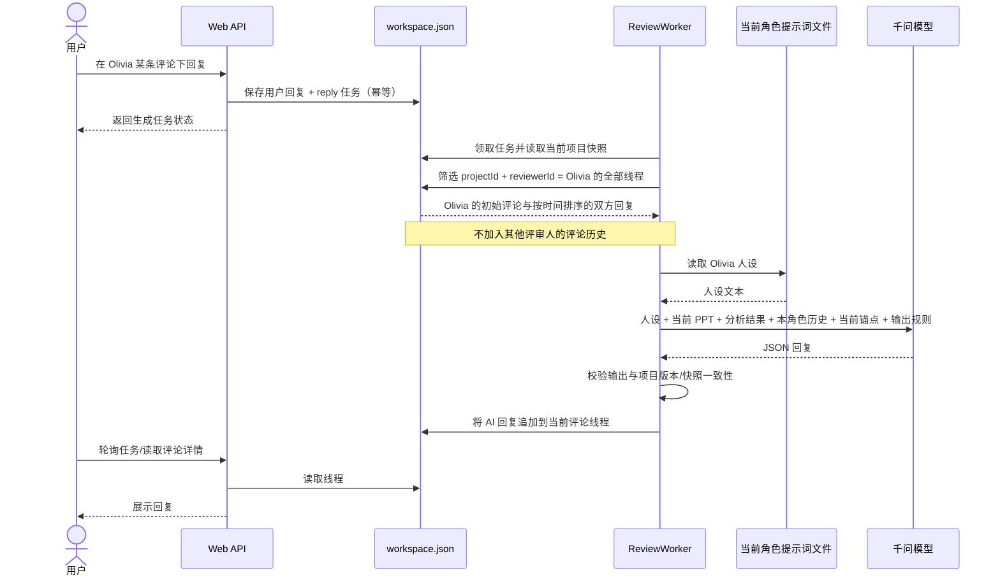
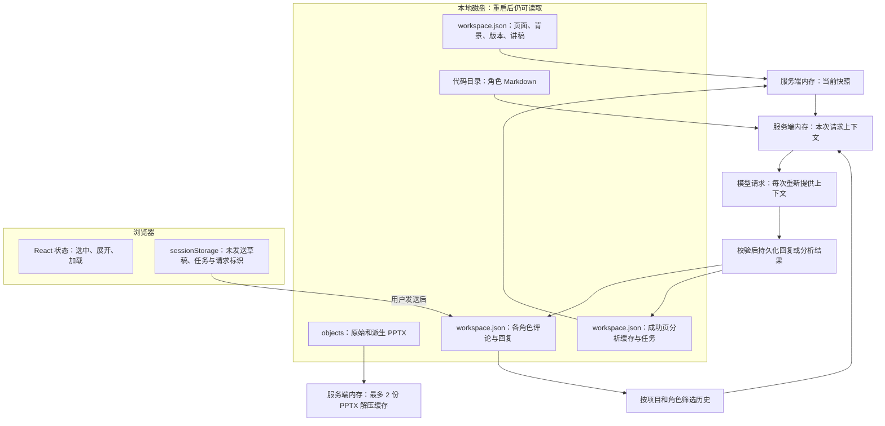
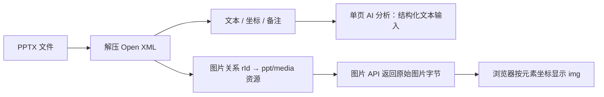
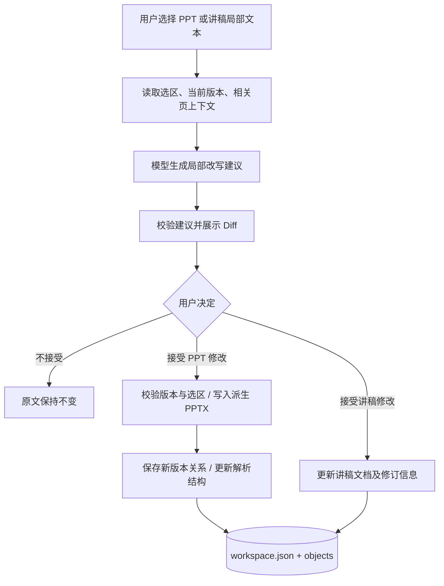

# 汇报预演室：当前技术架构与数据流

更新时间：2026-09-16。对应应用代码提交：`a8336d5`。本文描述实际实现，不把规划功能当作已完成能力。

## 1. 总体架构

这是 **单机文件持久化应用**，不是已经上线的云端多租户架构。前端由 esbuild 构建；Web 默认内嵌 Worker，也可以关闭 `EMBEDDED_WORKER` 后运行独立 Worker，共用同一绝对 `DATA_DIR`。没有实际接入 Redis、向量数据库或 PostgreSQL；`.env.example` 中的数据库/队列配置是预留项。

主要评审、回复、局部改写走运行时 `ReviewModelGateway`；基础服务仍保留 `JsonModelGateway` 路径，不能把所有 AI 功能理解成同一个角色聊天接口。

## 2. 上传 → 解析 → 分析 → 评论

重试复用已经解析的 `slides` 和成功页缓存，不重新解压整份 PPT，也不重跑命中的单页模型分析。但最终“各角色生成评论”仍可能重新调用，不能把它理解成整条分析任务完全零成本续跑。

缓存键包含项目 ID、模型/接口命名空间、提示词/Schema 版本、页面稳定 ID、内容与布局字段；不以页码或 PPT 版本号作为唯一依据，因此单纯重排页面能复用结果，修改页面内容会使相关缓存失效。缓存中的“提示词版本”是程序版本常量，不代表自动追踪每份角色 Markdown 的内容哈希。

进度表示已尝试处理的页数；到达 12/12 后仍可能需要生成角色评论。部分页面失败会保留诊断，所有页面失败则报错。模型超时/限流/输出不合格式也是独立错误，不是 PPT 解压失败。

## 3. 提示词何时进入模型

| 阶段 | 人设 | 模型接收的数据 | 结果 |
| --- | --- | --- | --- |
| 单页分析 | 无专属评审人设 | 单页元素、备注、布局、已有视觉摘要等结构化数据 | 页面摘要与问题依据 |
| 初始角色评审 | 当前评审人的 Markdown | 相同的整份 PPT、背景、逐页分析结果；不传其他角色评论 | 当前角色评论，每条 0–100 显示字符 |
| 用户回复某角色 | 同一角色 Markdown，每次重新读取 | 当前评论锚点、该角色在本项目的评论与双方历史、当前 PPT 全文与分析 | 该角色回复，0–100 显示字符 |
| PPT / 讲稿局部改写 | 不使用评论人人设 | 选中文本、相关页面上下文、修改要求 | 改写建议，等待接受或拒绝 |

真实请求的 `system` 是公共安全/事实约束加人设；`user` 是序列化 JSON，包含 `task`、`promptVersion`、`schemaVersion`、`outputSchema`、`input`。人设也放入 `input.personaPrompt`。这不是先后发三轮消息，而是在同一次请求内组合“人设、材料、规则”。

模型不合法输出会带纠错信息重试，最多 3 次尝试；失败的上一份输出只用于这次纠错，不等于持久聊天历史。材料被声明为数据，不应执行 PPT 中的指令。服务端校验并不能完全保证模型内容事实正确。

实际提示词目录：`packages/ai/src/prompts/reviewers/`。

| 文件 | 角色关注点 |
| --- | --- |
| `jack.md` | 决策、投入产出 |
| `olivia.md` | 证据、数据口径 |
| `ryan.md` | 商业化、增长 |
| `mia.md` | 产品体验、理解成本 |
| `emma.md` | 表达、传播风险 |
| `leo.md` | 工程交付、资源 |
| `sophie.md` | 听众疑问、记忆点 |

## 4. 每个评审人如何拥有独立上下文

**逻辑会话键是 `projectId + reviewerId`，物理保存键仍是 `commentId`。** 一个角色的多条评论在界面上有各自回复串；调用模型时，会把同项目同角色的这些串聚合。历史包含版本标记，可跨 PPT 版本存在；当前材料取当前版本。

同一项目同一角色一次处理一个回复，避免并发回复错序。不同角色共享 PPT 材料，不共享私人对话历史。这里的隔离是应用筛选逻辑，不是为每个人创建了模型供应商端的独立常驻 Agent。

## 5. 长期数据、短期上下文到底存在哪里

默认数据目录是 `D:\项目2\.local-data`，可通过 `DATA_DIR` 覆盖。下表是默认路径，不是云端存储地址。

| 数据 | 物理位置 / JSON 字段 | 生命周期与作用 |
| --- | --- | --- |
| 原始与新版本 PPTX | `.local-data/objects/<storageKey>` | 持久文件；已存版本不原地覆盖 |
| 项目与版本关系 | `.local-data/workspace.json` 的 `projects`、`sources`、`versions` | 项目持久记录 |
| PPT 结构、背景 | `slides[versionId]`、`contexts[versionId]` | 共享知识来源；不是向量索引 |
| 评论及双方回复 | `threads[commentId]` | 角色对话持久历史 |
| Worker 线程视图 | `aiWorker.threads[commentId]` | 与业务线程同步的处理视图，不是第二套独立记忆 |
| 页分析缓存 | `aiWorker.pageCache[hash]` | 成功页结果，支持重试复用 |
| 队列、分析结果与快照 | `aiWorker.jobs`、`aiWorker.analysis`、`aiWorker.snapshots` | 本地持久队列与工作快照 |
| UI 进度和上传状态 | `jobs`、`uploadStates`、`aiLinks` | 前端轮询与任务映射 |
| 讲稿内容与标注 | `documents[projectId][slideId]` 等业务字段 | 可编辑讲稿、修订与标注 |
| 人设 | `packages/ai/src/prompts/reviewers/*.md` | 源码管理，每次生成/回复读取 |
| 密钥 | 根目录 `.env` | 仅服务端使用，不进入 Git，不发给浏览器 |
| 未发送回复草稿 | 浏览器 `sessionStorage` 的 `review-draft:项目ID:评论ID` | 当前浏览器标签页会话；不是服务端长期记忆 |
| 本次模型 messages / 纠错输出 | 服务端进程内存 | 请求期间存在，无独立长期 messages 数据库 |
| UI 展开、选区、忙碌状态 | 浏览器 React 内存 | 刷新后通常重新建立 |

`LocalWorkspaceStore` 使用进程内串行队列、`workspace.lock` 跨进程锁、临时文件写入后原子重命名来更新 JSON。它不是数据库事务引擎；随着数据增长，整份 JSON 的读写和历史拼接会成为瓶颈。

**准确说法：已有长期持久化历史，但没有独立的“长期记忆智能系统”。** 目前没有向量检索、用户画像记忆、历史摘要压缩、Token 预算裁剪。短期上下文是每次从持久化数据重新拼装的请求，不是自动只保留最近几轮。历史变长时会增加请求体、耗时和上下文溢出风险。

## 6. 原图显示与 AI 分析是两条独立路径

图片端点：`/api/projects/:projectId/image/:versionId/:slideId/:elementId`。先验证版本属于项目，再读取图片。支持 PNG/JPEG/GIF/WebP；浏览器私有缓存最长 24 小时。服务端以文件哈希缓存最多两份解压档案，重启会失效。

当前没有把原图字节或 `image_url` 送给模型，也没有额外 OCR/视觉识别流水线。因此显示原图不等于 AI 看懂原图；结构化预览也不等于 PowerPoint 完整渲染，复杂母版、图表和特殊图形仍有保真限制。

## 7. 选中文字 → AI 改写 → 接受或拒绝

模型返回建议本身不等于修改原文件；用户接受后才应用。PPT 文件版本与讲稿文档修订属于不同的数据链，不应混为一体。

## 8. 当前边界与后续演进点（尚未实现）

1. 多用户：当前具备项目/角色维度筛选，但不是已经完成账号权限隔离的 SaaS。
2. 长记忆：后续可引入“角色摘要 + 最近轮次 + 相关历史检索”，现在仍是全量历史拼接。
3. 并发与存储：JSON 文件队列适合本地；多实例需要数据库、对象存储、可租约任务队列。
4. 视觉理解：现在本地提取和显示图片；如需模型理解图像，应增加明确的视觉输入策略、成本预算和缓存。
5. 汇报摘要：角色独立生成结果后，当前整体目标/叙事摘要取首个角色结果，不是额外的多角色共识模型。
6. 提示词追溯：人设文件随源码版本管理，但每次调用没有完整提示词快照审计表。

## 9. 代码索引

- 启动与内嵌调度：`apps/web/src/index.ts`
- HTTP / 图片路由 / 网关装配：`apps/web/src/server/http.ts`
- 业务编排：`apps/web/src/server/integrated-service.ts`、`service.ts`
- Worker 与业务数据同步：`apps/web/src/server/worker-store.ts`
- 任务租约与角色历史筛选：`apps/worker/src/review-worker.ts`
- 分页并发与缓存键：`packages/ai/src/pipeline.ts`
- 请求消息与角色独立生成：`packages/ai/src/gateway.ts`
- 人设加载：`packages/ai/src/reviewer-prompts.ts`
- 局部改写：`packages/ai/src/rewrites.ts`
- JSON 持久化与锁：`packages/db/src/local-store.ts`
- PPTX 解析与原图读取：`packages/pptx/src/index.ts`

本次文档生成未重新发送用户 PPT 到模型，也未修改运行中的项目数据。
